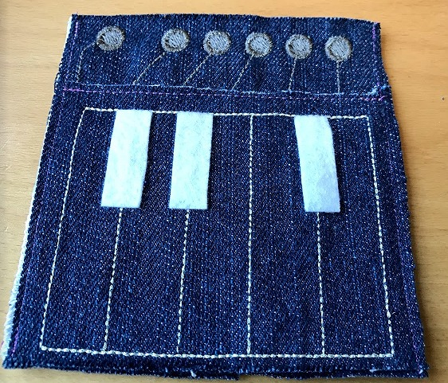
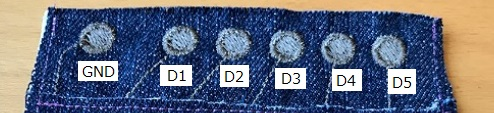
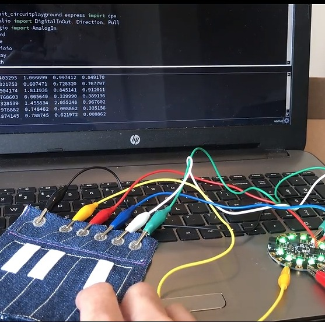

# Fabric Piano

How it works - [YouTube](https://youtu.be/3YOkoYgqCoc)

## Requirement
- [Adafruit CircuitPlayground Express](https://www.adafruit.com/product/3333)
- [CircuitPython](https://learn.adafruit.com/adafruit-circuit-playground-express/circuitpython-quickstart)
- [CircuitPython Libraries](https://learn.adafruit.com/welcome-to-circuitpython/circuitpython-libraries)

## Install
1. Connect Adafruit Circuit Playground via a USB cable. 
2. Copy CircuitPython uf2 file following [instruction](https://learn.adafruit.com/assets/47217).
3. Copy CircuitPython Libraries for Circuit Playground Express in the root directory. (lib/adafruit_circuitplayground).
4. Copy code.py in the root directory.

## Setup
Connect CircuitPlayground Express with alligator clips as following.

## How to play
Let's play the piano!

CircuitPlayground Express ligths its onboard LEDs and make a sound when to push it.

[Mu Editor](https://learn.adafruit.com/welcome-to-circuitpython/installing-mu-editor) is very convenient for edditing and debugging the code. 
You can see all sensor values with this serial monitor easily. 

## Licence

[MIT](https://github.com/tcnksm/tool/blob/master/LICENCE)

## Author

[etextilefun](https://github.com/etextilefun)
